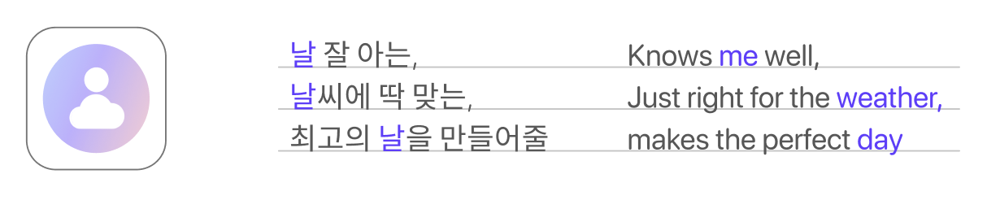

## Introduction
### Individual’s Subjective Experience-based Weather App
NAL helps you to expect the weather in the most intuitive way, by showing your own photos of the day with the most similar weather. And it notifies you to modify your schedule if it is not compatible with the weather forecast.

*This project was planned and designed in User Experience Design course in ID KAIST with Juye Lee, Pimpisut Chanpanich, Yubin Lee, Minseo Park, and me.  
And it was implemented as a web application by me.*

## Problem Definition
### Weather conditions are perceived differently to everyone and they can change unexpectedly.

- As weather is felt subjectively and differently to everyone, it is hard to understand the weather with only objective, numeric information.

- Due to abrupt, unanticipated weather changes, even well-planned events can be ruined easily.

## Main Feature
- **Personalized Weather** 
    - Based on weather information and user records about weather, NAL looks for the past day that is most similar to today's weather. By showing the your photos of the most similar day, it lets you remind the past sentiments and the feelings effectively.

- **Scheduling Based on Weather** 
    - Weather plays an important role in scheduling. NAL provides an intuitive calendar that gives you a quick look at your monthly schedules and weather forecasts.

- **Notification for Sudden Weather Changes** 
    - When the weather forecast suddenly changes, it may ruin your schedule. NAL notifies you immediately and helps to modify a plan easily. 

## Impact
- **Inclusive weather app for everyone** 
    - Weather data is difficult to understand for whom lack the ability to analyze numerical data, such as children or elederly, even though they are more vulnerable to weather changes than the usual. Weather information based on users' own experience allows them to expect weather most intuitively. 

- **Allow more flexibility in life attitude** 
    - Through NAL's notification on unanticipated weather changes, users will feel less frustrated and feel prepared for any weather conditions. This allows flexibility in daily life, leading to higher satisfaction in the long run. 

- **Enjoy making daily logs and benefit from it**
    - Users can enjoy making daily logs of themselves and how the weather felt like, which become their valuable memory of the past. With their own records, users can get benefits by being able to expect todays' weather most intuitively. 

## Brand Identity

- **Logo** 
    - With NAL's logo, similar to the sun over a cloud or the common profile icon, it conveys not only the identity of a general weather app but also NAL's unique identity, personalization to each user.  
- **Naming**
    - The service name embodies that the application knows me weel and provides weather-appropriate information to help user have a perfect day. 

## iF Design Award

## Stacks

